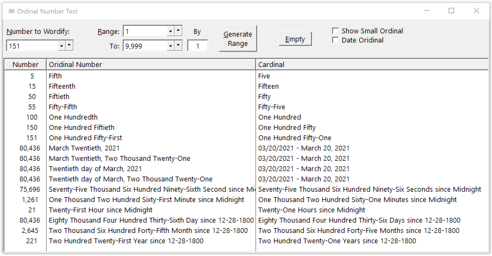

## Number-to-Words-Ordinal

Code to convert a Number to Words in Ordinal form, Cardinal form or Date as ordinal. 

Ordinal numeral are often used in formal or legal documents:

 * One Hundred Seventeenth Congress of the United States 
 * Forty-Seventh President of the United States 
 * March Twentieth, 2021
 * Twentieth day of March, 2021
 
Cardinal form is typically used to word amounts on checks e.g. $123,456 as One Hundred Twenty-Three Thousand Four Hundred Fifty-Six

