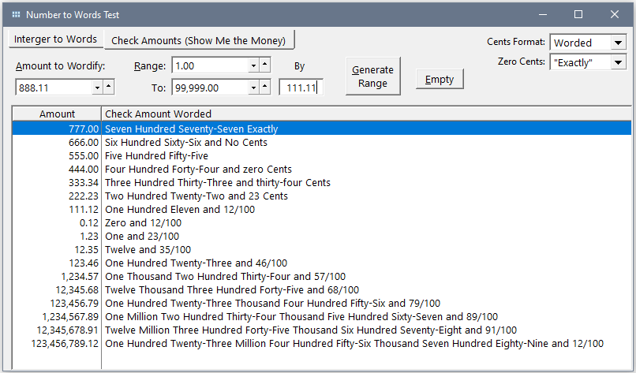

## Number-to-Words-Ordinal

Code to convert a Number to Words in Ordinal form, Cardinal form or Date as ordinal.

Ordinal numeral are often used in formal or legal documents:

 * One Hundred Seventeenth Congress of the United States
 * Forty-Seventh President of the United States
 * March Twentieth, 2021
 * Twentieth day of March, 2021

Cardinal form is typically used to word amounts on checks e.g. $123,456 as One Hundred Twenty-Three Thousand Four Hundred Fifty-Six


## Worded Check Amount - New 12/1/2021

New AmountInWords() function to create worded check amounts. This uses the existing Cardinal number function then simply adds code to append the pennies. A new Check Amounts Tab is added to test this function.

There are a three options for how to show Cents (12/100, 12 Cents, Twelve Cents) and fours options for Zero cents (Show, Omit, "No Cents", "Exactly").

Also included are two other functions to do worded amounts from other authors in the repo: ```SpellNumber_MarkGoldberg.clw SpellMoney_Unknown.clw.``` If you are going to use this code I would suggest first adding it to the test program to check it out.


